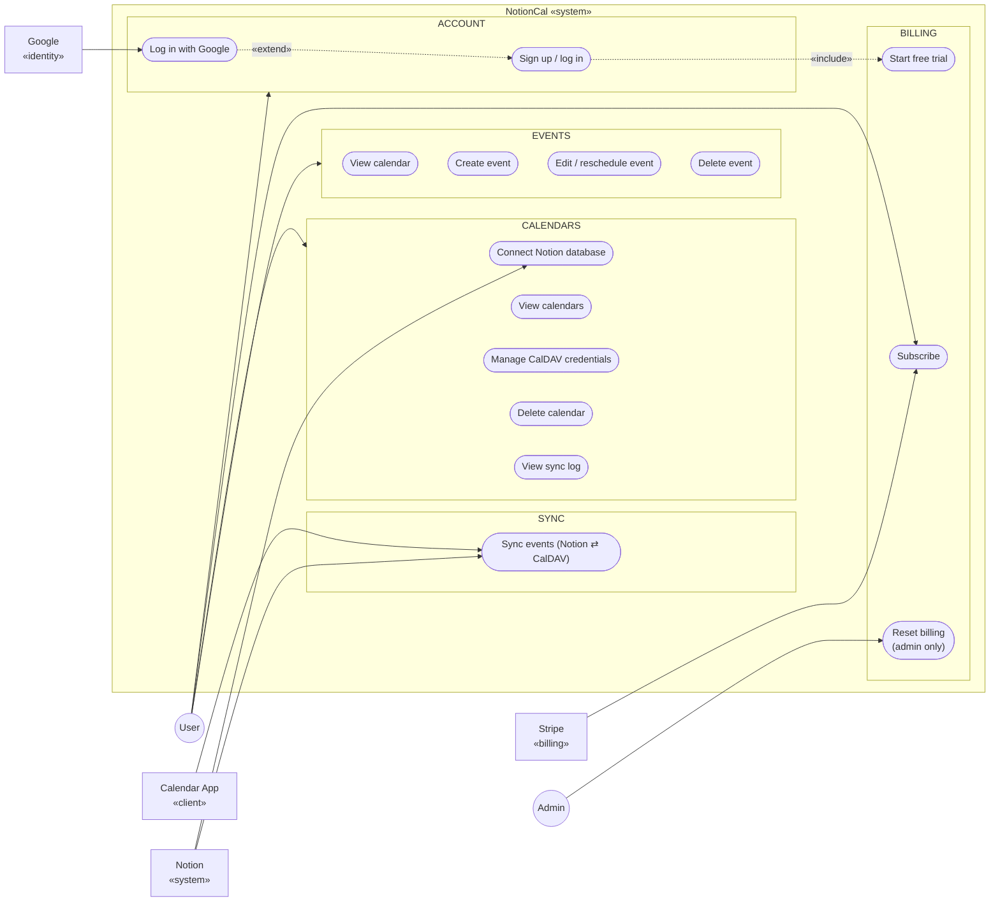
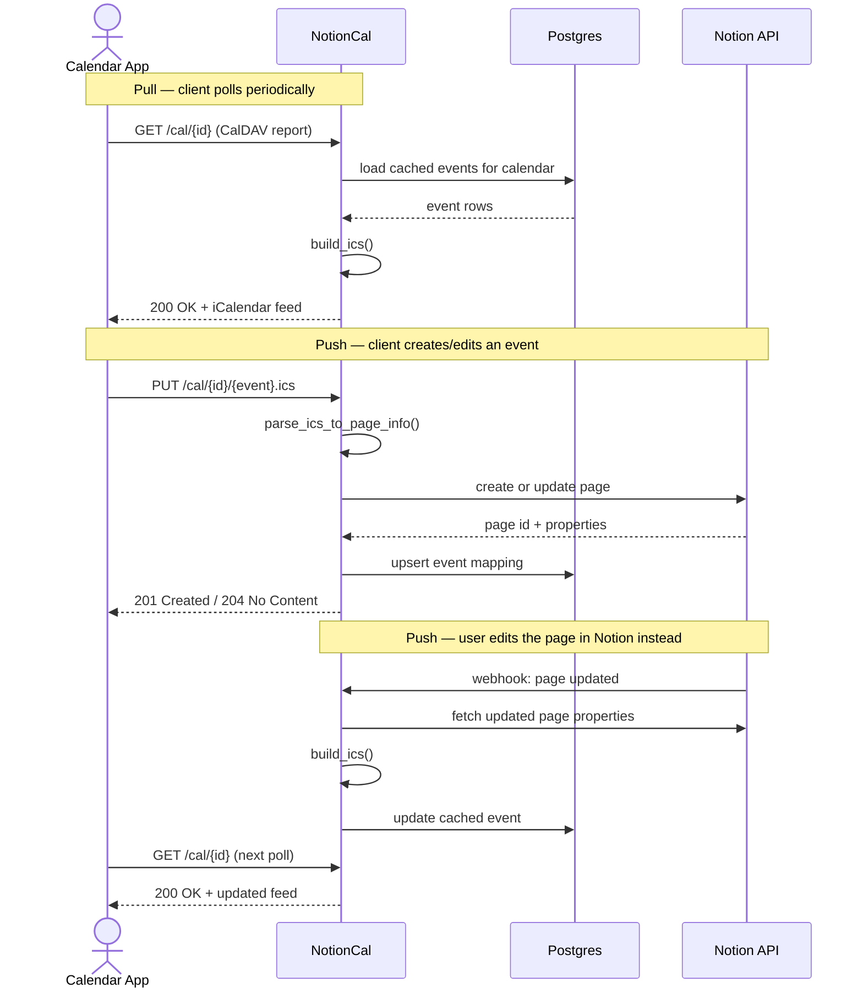
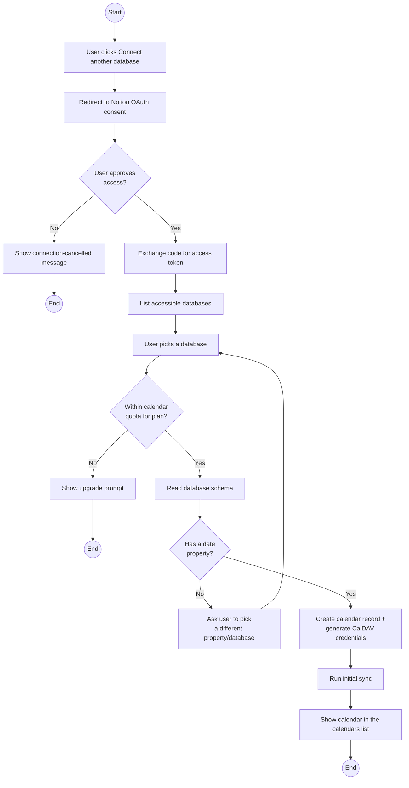
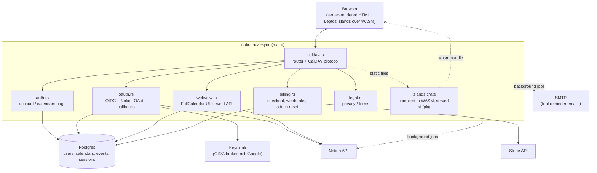
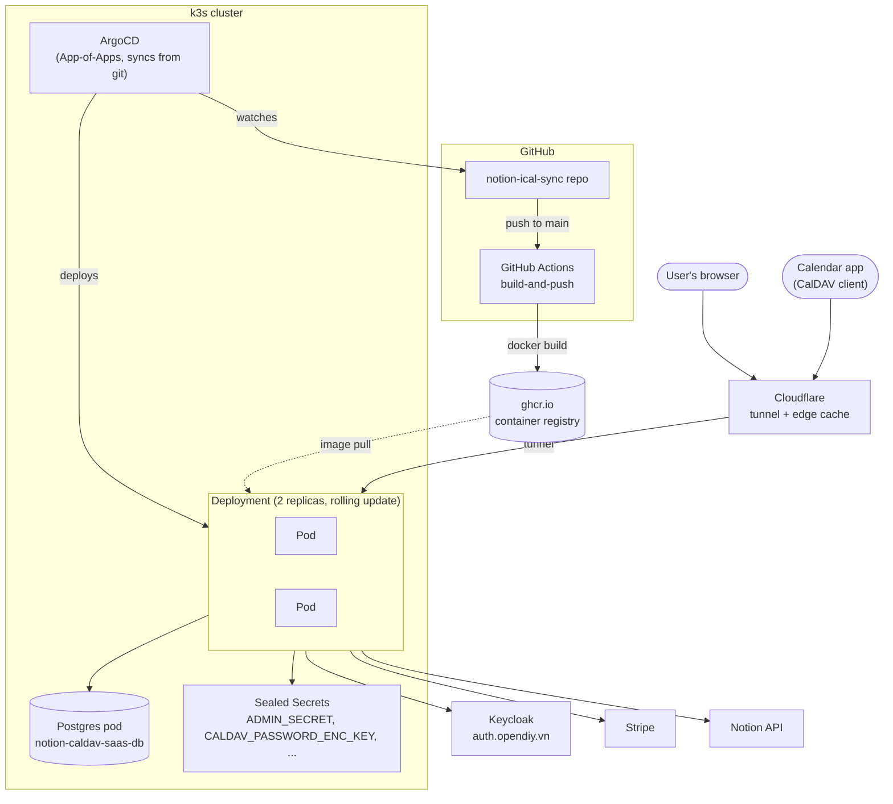

# System diagrams

All diagrams here are [Mermaid](https://mermaid.js.org/) code blocks, not
images — GitHub renders them natively, no extra tooling needed to view them.

- [Use case diagram](#use-case-diagram) — who uses NotionCal, and for what
- [Sequence diagram](#sequence-diagram--two-way-sync) — how a calendar app and Notion stay in sync
- [Activity diagram](#activity-diagram--connecting-a-notion-database) — the connect-a-database flow, decision by decision
- [Component diagram](#component-diagram) — how the axum service is put together internally
- [Deployment diagram](#deployment-diagram) — where it actually runs

## Use case diagram

Who uses NotionCal, and what each actor can do.

## Actors

| Actor | Role | Touches |
| --- | --- | --- |
| **User** | Primary actor — the person syncing a Notion database to their calendar app | Account, Calendars, Events, Subscribe |
| **Calendar App** | Apple Calendar / Google Calendar / any CalDAV client | Pulls the synced feed |
| **Google** | OAuth identity provider (via the Keycloak broker) | Log in with Google |
| **Notion** | External API + webhooks | Connect Notion database, Sync events |
| **Stripe** | Payments | Subscribe |
| **Admin** | Operator, authenticated via the `X-Admin-Secret` header | Reset billing (`POST /admin/reset-billing`) — dev/test tool, 404s unless `ADMIN_SECRET` is configured |

### Relationships

- **Solid line** — an actor directly uses a use case (or a whole group of them).
- **`«extend»`** — Log in with Google is an optional variant of Sign up / log in.
- **`«include»`** — Sign up / log in always starts a free trial.

## Sequence diagram — two-way sync

The core of the product: a CalDAV client can pull the feed at any time, a
write from either side propagates to the other, and a Notion edit shows up
without the client having to do anything but poll.

## Activity diagram — connecting a Notion database

What happens, decision by decision, between clicking **Connect another
database** and seeing it show up in the calendar list.

## Component diagram

Every page except the small interactive widgets (the confirm buttons — see
`crates/islands`) is still plain server-rendered HTML from these axum
handler modules; nothing runs through a client-side framework for routing.

## Deployment diagram

Push to `main` builds a Docker image (server binary + a separate
wasm-bindgen build of the islands crate) and ships it straight to
production — see `.github/workflows/ci.yml` and the `Dockerfile`.

